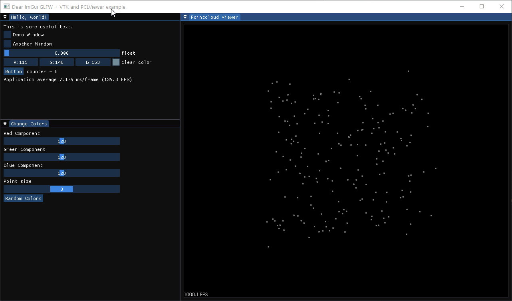

# imgui-pcl

Imgui implementation of the QT PCL Visualizer Example of the [Point Cloud Library](https://github.com/PointCloudLibrary/pcl/tree/master) using [imgui-vtk](https://github.com/trlsmax/imgui-vtk).

## vcpkg

- https://github.com/microsoft/vcpkg
- windows: VCPKG_DEFAULT_TRIPLET=x64-windows

### Dependencies

- Point Cloud Library
  - vcpkg install pcl[core,vtk]
- gl3w
- glfw
- vtk
  - will be installed with pcl
